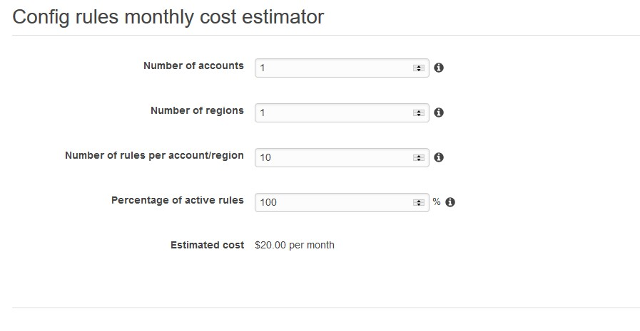

# Test RDK Tools
The advancement to public cloud has been phenomenal. Cloud computing has gone mainstream as more organizations shift their applications and workloads from on-premise data centers to public cloud platforms. Almost 96 % of companies, according to [one annual survey](https://www.rightscale.com/press-releases/rightscale-2018-state-of-the-cloud-report) have moved some part, their business to the cloud.
The cloud adoption is at a neck breaking speed and we we should not stop ourselves from welcoming this change. With this high rate of adoption the question that comes to our mind is are we doing it right?  I am not trying to put a corelation between the data security breaches and the rate of cloud adoption but the figures for [data breaches has been on the rise](https://www.afr.com/technology/figures-show-australian-data-breaches-on-the-rise-20190207-h1ayug). The [Office of the Australian Information Commissioner Notifiable Data Breaches for October – December 2018](https://www.oaic.gov.au/media-and-speeches/news/notifiable-data-breaches-for-october-december-2018) is certianly an eye opener. In 91 Days we had 262 data breaches which were **notified**. That's almost 3 data breaches per day. 97% of these breaches could have been stopped if we had some kind of autoamted system in place. Why are breaches on the rise? Where have we gone wrong? How can we stop this? What tools are out there that will help us remidiate. These questions lead to my weekend adventure.

My cause for making the system secure is more personal than professional. 

* **Why** : Push the limits and create new “Best Practices” for a secure world
* **How** : Continuous testing of configuration and auto remediate where posible
* **What** : We build Compliance as Code and auto remediation 

During my research I happen to stumble upon an *open-source* solution for AWS one of the popular public cloud players, [AWS Config RDK:Rules Development Kit](https://github.com/awslabs/aws-config-rdk). RDK use AWS Config Rules that provides automated, periodic security and compliance checking of AWS resources, and affords customers the ability to forego manual inspection of security configurations. You can write your own config rules as code test it and deploy it to your environment. Apart from the RDK I found a resourceful [community-based source of custom AWS Config Rules](https://github.com/awslabs/aws-config-rules)
Few of the rules that caught my attention.
    1. [Ensure CloudTrail is enabled in all regions](https://github.com/awslabs/aws-config-rules/tree/master/python/CLOUDTRAIL_ENABLED_V2)
    2. [Ensure all accounts have multi-factor authentication (MFA) enabled](https://github.com/awslabs/aws-config-rules/tree/master/python/IAM_USER_MFA_ENABLED)
    3. [Ensure no access keys exist for the root account](https://github.com/awslabs/aws-config-rules/tree/master/python/ROOT_NO_ACCESS_KEY)
    4. [Ensure IAM roles and users have mandatory policies attached](https://github.com/awslabs/aws-config-rules/tree/master/python/IAM_POLICY_REQUIRED)
    5. [Ensure access keys are rotated](https://github.com/awslabs/aws-config-rules/tree/master/python/IAM_ACCESS_KEY_ROTATED)

Here's an output of my 2 hour investment

## Reference
* [AWS Config RDK: Multi-account and multi-Region deployment](https://aws.amazon.com/blogs/mt/aws-config-rdk-multi-account-and-multi-region-deployment/)
* [How to develop custom AWS Config rules using the Rule Development Kit](https://aws.amazon.com/blogs/mt/how-to-develop-custom-aws-config-rules-using-the-rule-development-kit/)
* [AWS Config Rules Development Kit](https://github.com/awslabs/aws-config-rdk)
* [The Golden Circle of Common vs. Inspired Marketing and Leadership](https://www.disruptiveadvertising.com/business/why-how-what-in-that-order-using-the-golden-circle-to-improve-your-business-yourself/)
* [Announcing the AWS Config Rules Repository](https://aws.amazon.com/blogs/security/announcing-the-aws-config-rules-repository-a-new-community-based-source-of-custom-rules-for-aws-config/)
* [RDK: Getting Started](https://rdk.readthedocs.io/en/latest/getting_started.html)
* [Makefile reference](https://gitlab.d3s.mff.cuni.cz/evif/ivis-core/blob/604bcea712a9628c92b7712362ebc5966fcad41f/client/src/ivis-ws/event-drops/Makefile)